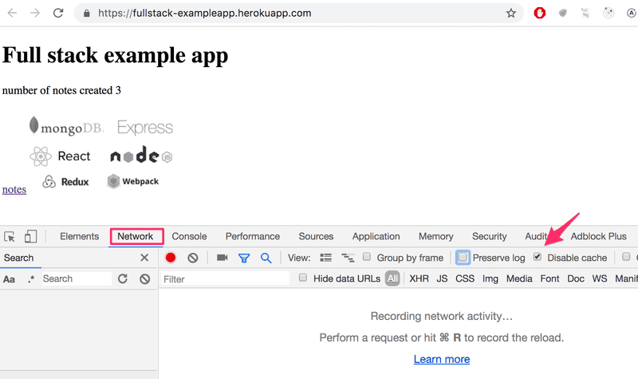
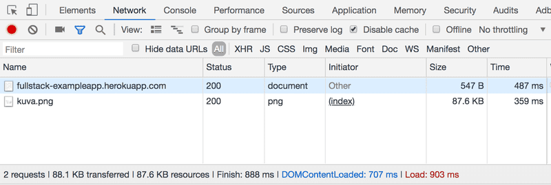
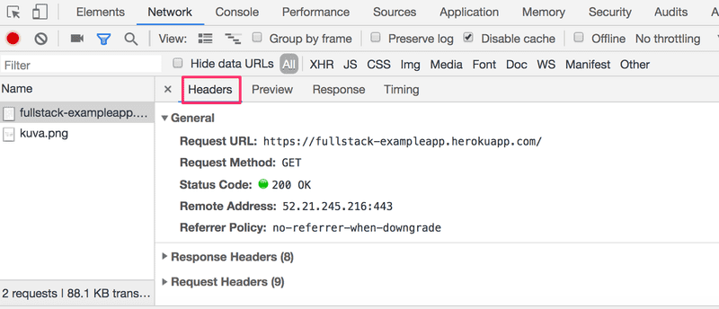
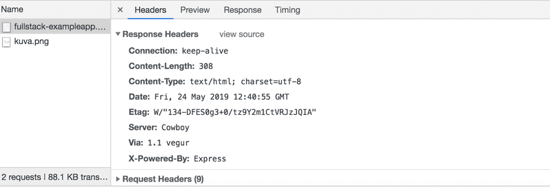
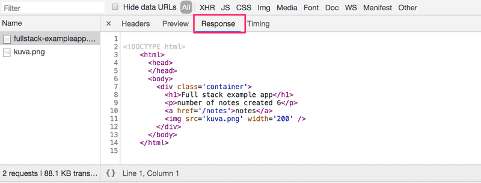
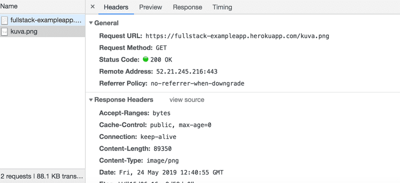
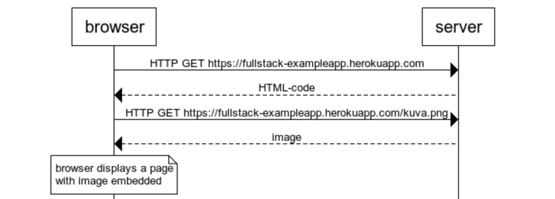

# Webアプリケーションの基礎
プログラミングを始める前に, https://fullstack-example.app.herokuapp.com/ にあるアプリケーションの例を調査することで,
Web開発の原則を学びます.
このアプリケーションのフィンランド語版は https://fullstack-example.now.sh にあります.
どちらを使うかは自由です.

これらのアプリケーションは, このコースの基本的な概念を示すためだけに存在しており,
Webアプリケーションがどのように作られるべきかを示すものではありません.
それどころか, それらはWeb開発の古い技術を示すものであり, 今日では悪しき慣習とさえ見られています.

推奨スタイルでのコーディングはPart1から始まります.

コースの残りの部分では, Chromeブラウザを使用してください.

ブラウザでサンプルアプリケーションを開きましょう.
これにはしばらく時間がかかる場合があります.

<b>Web開発の1つ目のルール:</b>
ブラウザ上でデベロッパーツールを常に開いておくこと.
macOSでは, `F12`か`option-cmd-i` を同時に押してコンソールを開きます.
Windowsでは, `F12`か`ctrl-shift-i`を同時に押してコンソールを開きます.

続ける前に, コンピュータ上で開発者コンソールを開く方法を確認し,
Webアプリケーションを開発する際には常に開いておくことを忘れないようにしてください.

コンソールは次のようになります:

Network タブが開かれていることを確認し, 次に示すように Disable Cache オプションをオンにします.
ログを保存すると, ページがリロードされたときに, アプリケーションによって表示されたログを保存することができます.

<b>注意:</b> 最も重要なタブは Console です. ただし, 概要では, Network タブを多く使用します.

## HTTP GET
サーバとWebブラウザは, <a href="https://developer.mozilla.org/en-US/docs/Web/HTTP">HTTP</a>プロトコルを使用して相互に通信します.
Network タブには, ブラウザとサーバがどのように通信するかが表示されます.

ページをリロードすると(F5キーを押すか, ブラウザの↺の記号を押す), コンソールには2つのイベントが発生したことが表示されます.

- ブラウザはサーバから fullstack-exampleapp.herokuapp.com/ の内容を取得します.
- そして, kuva.pngの画像をダウンロードします.

小さな画面では, コンソールのウィンドウを広げないと見えないかもしれません.

最初のイベントをクリックすると, 何が起こっているかの詳細情報が表示されます.

上部の General は, ブラウザがGETメソッドを使ってアドレス https://fullstack-exampleapp.herokuapp.com/ へのリクエストを行ったことを示しており,
サーバのレスポンスにはステータスコード200が含まれていたために, リクエストが成功したことを示しています.

リクエストとサーバのレスポンスにはいくつかのヘッダがあります:

上部にあるレスポンスヘッダは, レスポンスのサイズをバイト単位で表し, レスポンスの正確な時間を教えてくれます.
重要なヘッダである Content-Typeは, レスポンスがutf-8形式のテキストファイルであり, その内容がHTMLでフォーマットされていることを教えてくれます.
このようにして, ブラウザはレスポンスが通常のHTMLページであることを認識し, それを「Webページのように」ブラウザに表示します.

Response タブには, 通常のHTMLページである応答データが表示されます.
bodyセクションは, 画面に表示されるページの構造を決定します.

ページには`div`要素が含まれ, その中には見出し, ページノートへのリンク, `img`タグが含まれ,
作成されたノートの数が表示されます.

`img`タグがあるため, ブラウザはサーバから画像kuva.pngを取得するために2回目のHTTPリクエストを行います.
リクエストの詳細は以下の通りです.

リクエストは https://fullstack-exampleapp.herokuapp.com/kuva.png に行われ, そのタイプは HTTP GET です.
レスポンスヘッダを見ると, レスポンスサイズは89350バイトで, `Content-Type`は`image/png`なので,
png画像であることが分かります.
ブラウザはこの情報を利用して, 画像を正しくスクリーンにレンダリングします.

ブラウザで https://fullstack-exampleapp.herokuapp.com/ を開くことで発生する一連のイベントは, 以下のシーケンス図のようになります.

最初に, ブラウザはサーバにHTTP GETリクエストを送信して, ページのHTMLコードを取得します.
HTMLの`img`タグは, ブラウザにkuva.pngの画像を取得するように促します.
その後, ブラウザはHTMLページと画像をスクリーンに表示します.

気づくことは難しいですが, サーバから画像が取り込まれる前にHTMLページのレンダリングが始まります.